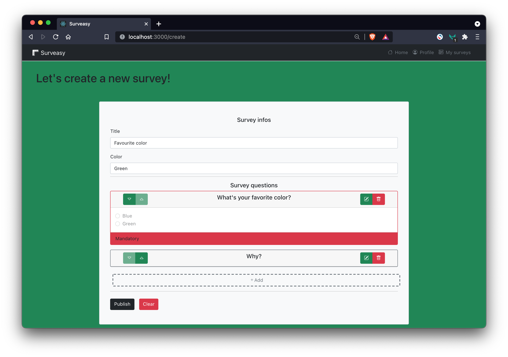

# Exam #1: "Survey"
## Student: s265350 ALAGNA FRANCESCO 

## React Client Application Routes

- Route `/`: redirects to the home route
- Route `/home`: homepage which shows all the surveys to let anyone to conduct them
- Route `/mine`: (requires log in) shows all the surveys created by the logged user (admin)
- Route `/take/:id`: allows to take a specific survey, the id of the survey is passed as parameter
- Route `/view/:id`: (requires log in) allows to see the answares for a specific survey in sequential mode, the id of the survey is passed as parameter
- Route `/create`: (requires log in) let the admin create a new survey through a form and publish it 
- Any other route will end in a 404 Not Found Page
- Any page which requires log in is inaccessible and will redirect to the homepage if the user is not logged in

## API Server

- GET `/api/surveys/all`
  - No parameters, purpose of retrevinig all surveys informations
  - response body contians a list of the general informations about all the surveys
  - Body response example:
    [{ 'id': 2, 'admin': 0, 'title': 'Cars', 'variant': 'danger', 'answaresNumber': 1},
    { 'id': 3, 'admin': 1, 'title': 'Glasses', 'variant': 'warning', 'answaresNumber': 2}]
  - Error response with status 500 and an object like { errors: [{ 'param': 'Server', 'msg': err }] }
- GET `/api/surveys/all/:admin`
  - admin id is requested as parameter, purpose of retrevinig all admin's surveys informations
  - response body contains a list of the general informations about all the surveys created by that admin
  - Body response example:
    [{ 'id': 3, 'admin': 1, 'title': 'Glasses', 'variant': 'warning', 'answaresNumber': 2},
    { 'id': 4, 'admin': 1, 'title': 'Reading passion', 'variant': 'info', 'answaresNumber': 1}]
  - Error response with status 500 and an object like { errors: [{ 'param': 'Server', 'msg': err }] }
- POST `/api/surveys`
  - No parameters, a survey object is requested in the body, purpose of saving a new survey informations
  - response body contains the id created for the new survey
  - Body response example: { 'id': 2 }
  - Error response: an object like { errors: [{ 'param': 'Server', 'msg': err }] }
- PUT `/api/surveys:id`
  - survey id is requested as parameter, purpose of updating the number of answares for the corresponding survey
  - response body content is empty
  - Error response with status 500 and an object like { errors: [{ 'param': 'Server', 'msg': err }] }
- GET `/api/questions/all/:id`
  - survey id is requested as parameter, purpose of retriving all the questions for the corresponding survey
  - response body contains the list of questions
  - Body response example: 
    [{ 'survey': 1, 'id': 1, 'title': 'If not, why?', 'type': 'open', 'min': 0, 'max': null, 'possibleAnswares': null },
    { 'survey': 1, 'id': 2, 'title': 'Choose', 'type': 'closed', 'min': 0, 'max': 0, 'possibleAnswares': '[{ 'id': 0, 'answare': 'Pizza' },{ 'id': 0, 'answare': 'Sushi' }]' }]
  - Error response with status 500 and an object like { errors: [{ 'param': 'Server', 'msg': err }] }
 - POST `/api/questions`
  - No parameters, a question objects is requested in the body, purpose of saving the question for a survey
  - response body contains an id of the saved question
  - Body response example: { 'id': id }
  - Error response with status 500 and an object like { errors: [{ 'param': 'Server', 'msg': err }] } -->
- GET `/api/answares/all/:id`
  - survey id is requested as parameter, purpose of retriving all the answares for the corresponding survey
  - response body contains the list of answares
  - Body response example: 
    [{ 'survey': 1, 'id': 1, 'username': 'Giuseppe Verdi', 'answares': '[{ 'id': 0, 'answare': 'Pizza' },{ 'id': 0, 'answares': '[{ 'id': 0, answare: true }, { 'id': 1, answare: false }]' }]' },
    { 'survey': 1, 'id': 2, 'username': 'Mario Rossi', 'answares': '[{ 'id': 0, 'answare': 'Lasagna' },{ 'id': 0, 'answares': '[{ 'id': 0, answare: false }, { 'id': 1, answare: true }]' }]' }]
  - Error response with status 500 and an object like { errors: [{ 'param': 'Server', 'msg': err }] }
- POST `/api/sessions`
  - receives the username and password in the body and perform the login
  - response body contains the informations about the logged in admin (except for the password and its hash)
  - Body response example: { 'id': 0, 'name': 'Mario Rossi', 'username': 'mario.rossi@gmail.com' }
  - Error response with status 401 and an object like { error: 'Unauthenticated user!' }
- DELETE `/api/sessions/current`
  - receives the username and password and perform the logout
  - body response in empty
  - Error response with status 401 and an object like { error: 'Unauthenticated user!' }
- GET `/api/sessions/current`
  - rretrives (eventual) user's prevously opened session
  - response body contains the informations about the logged in admin (except for the password and its hash)
  - Body response example: { 'id': 0, 'name': 'Mario Rossi', 'username': 'mario.rossi@gmail.com' }
  - Error response with status 401 and an object like { error: 'Unauthenticated user!' }

## Database Tables

- Table `admins` - contains the information about the admins (id, name, username, password hash)
- Table `surveys` - contains the informations about the surveys (id, admin id, title, color, number of answares)
- Table `questions` - contains a question informations related to a survey (survey id, id, title, type of question, min and max choices, list of possible answares for closed answares)
- Table `answares` - contains the surveys answares (survey id, id, username, list of answares)

## Main React Components

- `PageSwitch` (in `App.js`): Switches through the different pages and defines the methods for submitting surveys, quesions and answares and for performing login and logout also handles the local updates
- `Surveys` (in `Surveys.js`): serves the list of surveys (the "home" and the "my surveys" page) and let's the user navigate throw the list of surveys
- `ViewSurvey` (in `ViewSurvey.js`): let's the user take a survey and submit the answares and the admin to see the answares given to a survey
- `CreateSurvey` (in `CreateSurvey.js`): let's the admin create a new survey and submit it

(only _main_ components, minor ones may be skipped)

## Screenshot

;

## Users Credentials

- mario.rossi@gmail.com, passwordMR (owns: 'Let's be friends' and 'Cars' surveys)
- giuseppe.verdi@gmail.com, passwordGV (owns: 'Glasses' and 'Reading passion' surveys)
